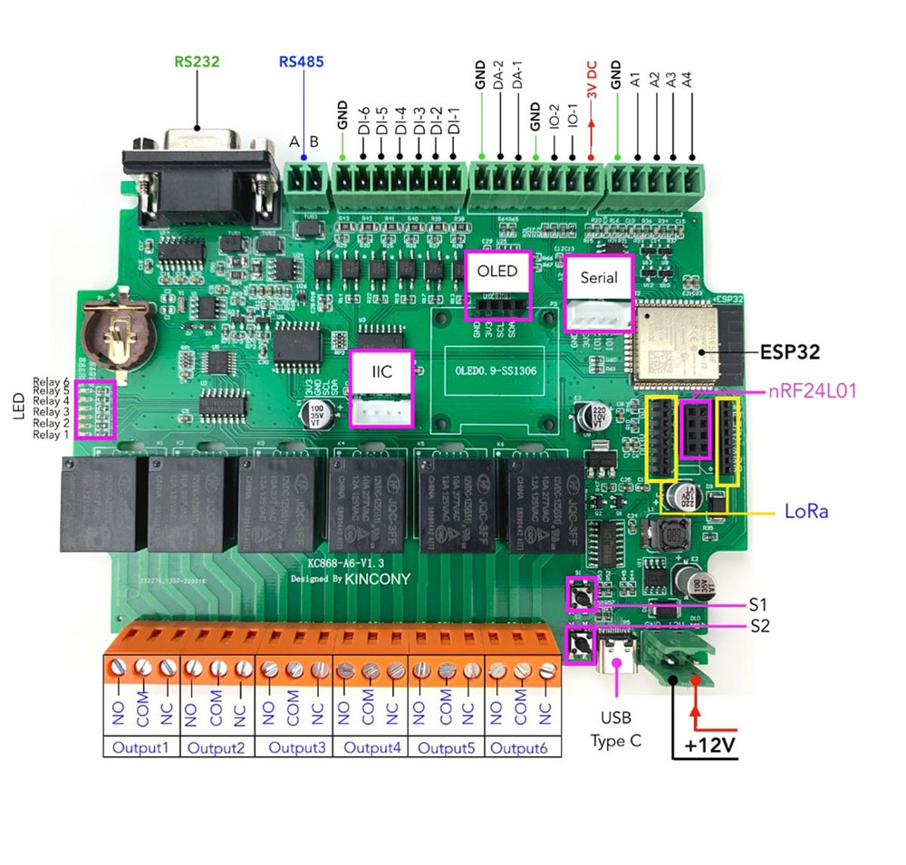

# KC868-A6 Node

ESP32-based 6-relay controller firmware for the [KinCony KC868-A6](https://www.kincony.com/kc868-a6.html) board, integrated with the [IoT Platform](https://iot.unitani.com).

---

## Hardware

**Board:** KinCony KC868-A6 (ESP32-WROOM-32E, Wi-Fi)

| Feature | GPIO / Address | Notes |
|---|---|---|
| I2C SDA | GPIO4 | Shared bus |
| I2C SCL | GPIO15 | Shared bus |
| Relay board (PCF8574) | I2C `0x24` | R1–R6, active LOW |
| Input board (PCF8574) | I2C `0x22` | DI1–DI6, active LOW, debounced |
| OLED SSD1306 128×64 | I2C `0x3C` | Optional |
| EC sensor | GPIO36 (A1) | 0–5V analog |
| Water level sensor | GPIO39 (A2) | 0–5V analog |
| DS18B20 temperature | GPIO32 (IO1) | 1-Wire |

---

## Features

- **6 relays** via PCF8574 (active LOW, I2C)
- **6 digital inputs** via PCF8574 (active LOW, debounced 50 ms) — each input mirrors its corresponding relay
- **OLED SSD1306** — two alternating pages (relay/input states → sensor readings), page switches every 4 s
- **DS18B20** temperature reading (non-blocking, every 10 s)
- **EC sensor** with two-point calibration: `EC (mS/cm) = (V − offset) × slope`
- **Water level sensor** with min/max voltage calibration: `% = clamp((V − vMin) / (vMax − vMin) × 100, 0, 100)`
- Captive-portal Wi-Fi setup (AP mode on first boot)
- **Platform provisioning** — connects to `iot.unitani.com` using your topic and API key; MQTT credentials are configured automatically
- Telemetry published to MQTT every 30 s, and on every relay/input state change
- Basic Auth on all web UI routes (`admin` / `kc868a6`)
- Self-healing Wi-Fi: retries STA indefinitely on connection loss, never falls back to AP mode once provisioned
- **Factory reset button** — hold the onboard BOOT button (GPIO0) for 5 seconds at runtime to clear saved WiFi/MQTT/provisioning config and reboot into the AP setup portal (recovers a device stuck with bad WiFi credentials)
- **OTA updates** — subscribes to `<base>/ota/command` (MQTT, retained); on receiving `{"version":"x.y.z","url":"..."}` with a version different from the running firmware, downloads and flashes the `.bin` via `HTTPUpdate` over TLS, then reboots. Triggered from the platform dashboard (Devices → device → OTA) after uploading a `.bin` under Dashboard → Firmware.

---

## Getting Started

### 1. Hardware preview



### 2. Flash the firmware

```bash
cd kc868a6Node
pio run --target upload
pio run --target uploadfs   # upload LittleFS web files
```

### 3. Wi-Fi setup

On first boot the device creates an access point:

```
SSID: KC868-A6-XXXXXX   (last 3 bytes of MAC, no password)
```

Connect to it and open any browser — the captive portal loads automatically. Enter your Wi-Fi SSID and password, then save. The device reboots and connects to your network.

After connecting, the device is reachable at:

```
http://kc868a6-XXXXXX.local/
```

### 4. Connect to the platform

Open `http://kc868a6-XXXXXX.local/settings` (or tap **Settings** on the dashboard page).

Enter:
- **Device Topic** — the base topic you want, e.g. `a6/a6-001`. This must match the Device Name on the platform dashboard at `iot.unitani.com`.
- **API Key** — from **Settings → API Keys** on the platform dashboard.

Tap **Connect to Platform**. The device calls the platform API, receives MQTT credentials, and connects automatically. No manual MQTT configuration is needed.

---

## Web UI

After connecting to your network, open `http://kc868a6-XXXXXX.local/` in a browser (Basic Auth: `admin` / `kc868a6`).

| Page | Path | Description |
|---|---|---|
| Dashboard | `/` | Relay toggles, digital input states, sensor readings, calibration wizards |
| Settings | `/settings` | Platform provisioning (topic + API key) |

### Dashboard — Relay control

The dashboard shows 6 relay cards. Each card has a toggle switch and ON/OFF buttons. Changes take effect immediately and are reflected on the OLED and published via MQTT.

### Dashboard — Sensor calibration

The dashboard includes guided wizards for both sensors. Calibration values are saved to NVS and survive reboots.

**EC two-point calibration**
1. Submerge the probe in **solution 1** (e.g. 1.413 mS/cm) → tap **Capture Reading** → enter the known EC value
2. Rinse, submerge in **solution 2** (e.g. 12.88 mS/cm) → tap **Capture Reading** → enter the known EC value
3. Review the computed slope and offset → tap **Save**

The wizard solves `slope`/`offset` as two simultaneous equations from the two `(voltage, known EC)` points, so it doesn't matter which solution you capture first — a low-EC-first run and a high-EC-first run produce the same result. Just use two standards whose voltages aren't too close together (a narrow spread inflates the slope and can trip the 1000 mS/cm/V cap).

**Water level calibration**
1. With the tank **empty** → tap **Capture Empty Level**
2. With the tank **full** → tap **Capture Full Level**
3. Review the voltage range → tap **Save**

---

## MQTT Topics

Base topic is set during provisioning (e.g. `a6/a6-001`).

| Topic | Direction | Payload |
|---|---|---|
| `<base>/relay/<1-6>/set` | Subscribe | `ON` / `OFF` / `1` / `0` / `TOGGLE` |
| `<base>/relay/<1-6>/state` | Publish (retained) | `ON` / `OFF` |
| `<base>/input/<1-6>/state` | Publish (retained) | `ON` / `OFF` |
| `<base>/telemetry` | Publish every 30 s | JSON (see below) |
| `<base>/status` | Publish (retained, LWT) | `online` / `offline` |

### Telemetry payload

```json
{
  "relay":       [1, 0, 0, 1, 0, 0],
  "input":       [0, 0, 1, 0, 0, 0],
  "temperature": 27.4,
  "ec":          1.85,
  "water_level": 62.3,
  "fw":          "1.0.4",
  "ts_ms":       123456789
}
```

---

## Dependencies

Managed by PlatformIO (`platformio.ini`):

| Library | Version |
|---|---|
| bblanchon/ArduinoJson | `^6.21.3` |
| esphome/ESPAsyncWebServer | latest |
| esphome/AsyncTCP | latest |
| adafruit/Adafruit SSD1306 | `^2.5.7` |
| adafruit/Adafruit GFX Library | `^1.11.5` |
| paulstoffregen/OneWire | `^2.3.8` |
| milesburton/DallasTemperature | `^3.11.0` |

---

## Platform Integration

This node is fully integrated with the IoT SaaS platform at [iot.unitani.com](https://iot.unitani.com):

- Dashboard card shows 6 relay toggles, 6 DI indicators, and sensor meter bars
- Compatible with sensor-based and time-based automations (relay actions)
- `node_type` registered as `kc868a6Node`
